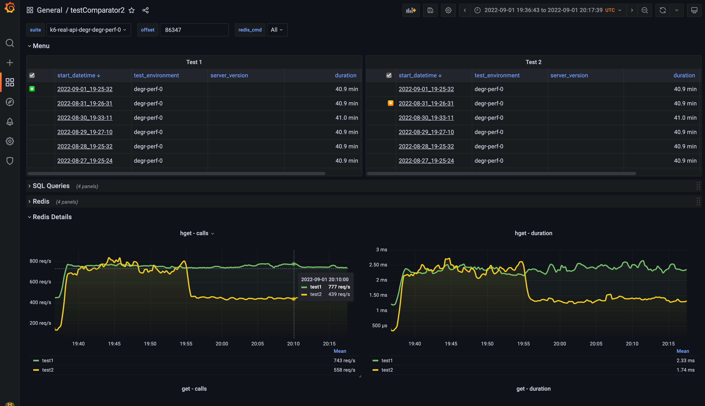

<!-- _class: lead
-->

# Сравнение тестов

## Смирнов Вячеслав

###  Miro 

<!--
_footer: Image by Vlad Gerasimov on <a href="https://vlad.studio/">vlad.studio</a>
 -->


---
<!-- _class: title -->

# Инженер  Miro
## Развиваю  qa_load


<!-- 
Повышаю качество более десяти лет. Занимаюсь системой дистанционного банковского обслуживания юридических лиц. Основной профиль моей работы — тестирование производительности. Развиваю сообщество инженеров по тестированию производительности, помогая коллегам в telegram чате «QA — Load & Performance».
-->

---
<!-- _class: main -->

# Про применение __Grafana__ для сравнения метрик

<!--
_footer: Image by Vlad Gerasimov on <a href="https://vlad.studio/">vlad.studio</a>
 -->


---
# Содержание


# 📊 __Start__/__Stop__-time и их фиксация при отладке

# 📊 Запись статистики в одну точку во времени

# 📊 Заполнение переменной __Grafana__ из ячейки

# 📊 Сохранение прежнего значения переменной

# 📊 Добавление __tag__/__label__ из переменной в ответ

# 📊 Математические операции в __Grafana__

# 📊 Смещение метрик при выводе в __Grafana__


---

<!-- _class: main -->

# __TestId__/__RunId__/__*Id__ или __Start__+__StopTime__ для сравнения тестов
<!--
_footer: Image by Vlad Gerasimov on <a href="https://vlad.studio/">vlad.studio</a>
 -->
---
# __4.__ 📊 __Start__/__Stop__-time и их фиксация при отладке

- __Grafana__ и сравнение метрик из __Prometheus__, __Victoria__, __InfluxDB__

- __Jenkins__ и фиксация моментов старта и завершения теста


---

# __Grafana__ и сравнение метрик __Prometheus__, __InfluxDB__, ...



---

# __Grafana__ и сравнение метрик __Prometheus__, __InfluxDB__, ...

```java
1. Отобразить таблицу по первому тесту:
  - "Start" и "Stop" - формат unixTimeStamp, тип "tag"/"label"
2. При клике по строке первой таблицы сохраняем в URL: 
  - from="Start", to="Stop", Start1="Start"
3. Отобразить таблицу по второму тесту
  - "Start" и "Stop" - формат unixTimeStamp, тип "tag"/"label"
  - "Start1" - дополнительная колонка из переменной "Start1"
  - "Offset" - вычисляемая колонка "Start1"-"Start"
4. При клике по строке второй таблицы сохраняем в URL: 
  - "Offset"="Offset"
5. Отобразить метрики по первому и второму тестам
  - по первому просто от "from" до "to"
  - по второму со смещением "Offset"
```

---

# Самое главное: __Start__ и __Stop__, тип __tag__/__label__

```java
1. Отобразить таблицу по первому тесту:
  - "Start" и "Stop", тип "tag"/"label", формат unixTimeStamp
2. При клике по строке первой таблицы сохраняем в URL: 
  - from=Start, to=Stop, Start1=Start
3. Отобразить таблицу по второму тесту
  - "Start" и "Stop", тип "tag"/"label", формат unixTimeStamp
  - Start1 - дополнительная колонка из переменной Start1
  - Offset - вычисляемая колонка Start1-Start
4. При клике по строке второй таблицы сохраняем в URL: 
  - Offset=Offset
5. Отобразить метрики по первому и второму тестам
  - по первому просто от from до to
  - по второму со смещением Offset
```

---

<!-- _class: main -->

# Как сохранить __Start__/__Stop__-time для каждого запуска теста?
<!--
_footer: Image by Vlad Gerasimov on <a href="https://vlad.studio/">vlad.studio</a>
 -->
---

# __Jenkins__ и фиксация моментов старта и завершения

## До теста: сохранить __Start__ и расчётный __Stop__-time
- как __tag__/__label__

## Тест: ab, curl+bash, k6, jmeter, locust, gatling, junit, ...
- любой тест!

## После теста: сохранить __Start__ и __Stop__-time фактические
 - как __tag__/__label__ 

---

# __Jenkins__ и фиксация моментов старта и завершения

## До теста: сохранить __Start__ и расчётный __Stop__-time
- как __tag__/__label__ в формате unixTimeStamp для UTC

## Тест: ab, curl+bash, k6, jmeter, locust, gatling, junit, ...
- любой тест, без метрик, распределенный, нестабильный, ...

## После теста: сохранить __Start__ и __Stop__-time фактические
 - как __tag__/__label__ в формате unixTimeStamp для UTC
 - +value __Duration__ или любое другое
 - +tag/label для __ServerVersion__, __Environment__, __PipelineName__, __Scenario__

---
# Пример записи метрик в формате __InfluxLine__ в __VM__

```python
metricTime = 1640980800 # Fri Dec 31 2021 20:00:00 GMT+0000
reqBody = f'testStats,' \
        f'suite={row["suite"]},' \
        f'environment={row["env"]},' \
        f'version={row["version"]},' \
        f'start={row["startUnix"]},' \
        f'stop={row["stopUnix"]} ' \
        f'duration={row["duration"]} {metricTime}000000000'

http.post(
    url="http://victoriaMetrics:8428/write",
    data=reqBody
)
```


---
<!-- _class: main
-->

# Запись статистики в одну точку во времени
<!--
_footer: Image by Vlad Gerasimov on <a href="https://vlad.studio/">vlad.studio</a>
 -->
---
# Пример записи метрик в формате __InfluxLine__ в __VM__

```python
metricTime = 1640980800 # Fri Dec 31 2021 20:00:00 GMT+0000
```

# Пример выборки данных из в __VM__
```
(testStats_duration{suite=~"${suite}"} > 100) @1640980800
```

---
<!-- _class: main
-->

# Заполнение переменной __Grafana__ из ячейки
<!--
_footer: Image by Vlad Gerasimov on <a href="https://vlad.studio/">vlad.studio</a>
 -->
---

# Заполнение переменной __Grafana__ из ячейки

```
var-test2_time=${__data.fields.startUnix}
```

---
<!-- _class: main
-->

# Сохранение прежнего значения переменной


<!--
_footer: Image by Vlad Gerasimov on <a href="https://vlad.studio/">vlad.studio</a>
 -->
---
# Сохранение прежнего значения переменной

```
/d/${__dashboard}/?${source:queryparam}&${suite:queryparam}
```

---
<!-- _class: main
-->

# Заполнение ячейки таблицы из переменной
<!--
_footer: Image by Vlad Gerasimov on <a href="https://vlad.studio/">vlad.studio</a>
 -->
---
# Пример выборки данных из __VM__
## c заполнением ячейки таблицы из переменной

```java
label_replace(
    (testStats_duration{suite=~"${suite}"} > 100) @1640980800,
    "test1_time",
    "${test1_time}",
    "start_datetime", 
    ".*"
)
```

---
# Пример выборки данных из __InfluxDB__
## c заполнением ячейки таблицы из переменной

```sql
select 
    last(max)-last(max)+${test1_time} as "test1_time",
    last(duration)
from
    testStats_duration
where sute=~"${suite:regex}" and $timeFilter
group by
    "version", "environment"
```

---
<!-- _class: main
-->

# Математические операции в __Grafana__
<!--
_footer: Image by Vlad Gerasimov on <a href="https://vlad.studio/">vlad.studio</a>
 -->
---
<!-- _class: main
-->

# Смещение метрик при выводе в __Grafana__
<!--
_footer: Image by Vlad Gerasimov on <a href="https://vlad.studio/">vlad.studio</a>
 -->
---

# Смещение метрик при выводе в __Grafana__
# __offset__ для __PromQL__

```
sum  (
  rate(
      redis_commands_total{
      }[$__rate_interval] offset ${offset}s
    )
)
```

---

# Смещение метрик при выводе в __Grafana__
# __offset__ для __InfluxQL__

```sql
select 
    max(total)
from "redis_commands"
where 
    time > ${offset} + ${__from} and 
    time < ${offset} + ${__to}
```

